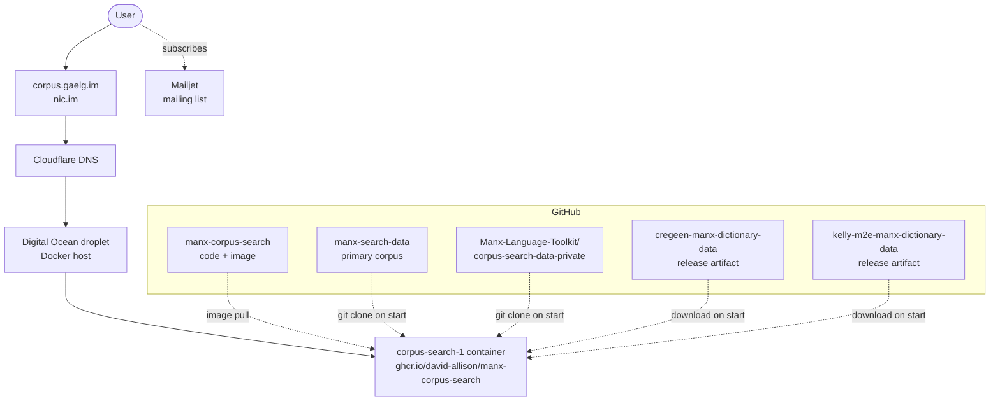

# Operations

This document covers how to run, maintain and transfer the Manx Corpus Search.

## Summary

- All data exists online in a safe format.
- Running a copy on your computer takes a couple of commands. 
  - Anyone can set up a full local copy of the corpus in minutes (see "Running it yourself").

The project is operationally maintained by **David Allison**. New documents are added periodically to the corpus. Technical details are in the Appendix at the end of this document.

## Minimum viable maintenance

To keep the live site running with no other changes, the required tasks are:

- Pay the host (~$12/month, Digital Ocean)
- Renew the domain via nic.im (~£280 every 10 years, next renewal: 28/12/2032)

The service can run unattended for years. Document uploads are done entirely through GitHub.

## Accounts

| Resource | Provider                         | Held by       | Auth | Notes                  |
|---|----------------------------------|---------------|---|------------------------|
| Domain (corpus.gaelg.im) | nic.im                           | David Allison | Personal email | Paid until 28/12/2032  |
| DNS | Cloudflare                       | David Allison | David's Google Account | Rob has access         |
| Hosting | Digital Ocean (droplet, 2GB RAM) | David Allison | David's Google Account | $12/month              |
| Mailing list | Mailjet                          | David Allison | hello@gaelg.im |                        |
| GitHub repositories | github.com/david-allison         | David Allison | | Multiple project repos |

Credentials are not in this document. To request a transfer, see "Roles" below.

⚠️ Cloudflare and Digital Ocean both authenticate via David's Google Account. The domain uses a username/password combination, and can be used to bootstrap recovery 

## Recurring costs

- Hosting: ~$12/month (Digital Ocean)
- Software: £59.99/year (Microsoft 365 Personal Classic)
- Domain: ~£280 every ten years (paid until 28/12/2032)
- Total ongoing: ~$225/year for the next several years 

Costs have been paid personally by the current maintainer since the project began.

---

## Runbooks

### The site is down

1. SSH in to the Digital Ocean droplet as root: `ssh root@<IP>`
2. Restart the container: `docker restart corpus-search-1`
3. If that doesn't recover the service, check `docker logs corpus-search-1` and consult the repository README for full deployment instructions.

For disaster recovery, the service can be redeployed on any Docker-capable host with the two commands shown below.

### Running it yourself

The pre-built image is published to GitHub Container Registry:

```
docker pull ghcr.io/david-allison/manx-corpus-search:master
docker run --rm -p 8080:8080 ghcr.io/david-allison/manx-corpus-search:master
```

Then visit http://localhost:8080.

Network access is required at startup. The container fetches data and dictionaries from GitHub on each launch.

### Reviewing document submissions

Documents are added to the corpus via pull requests against `manx-search-data`. GitHub Actions validate format and structure on each PR.

The maintainer task on a submission:

1. Review the PR. Actions catch format issues; human review covers metadata, attribution, and content edge cases.
2. Fix issues in the submission directly. Push corrections to the contributor's branch, or follow up with commits after merge. 
    - `git` knowledge is required
3. Squahs merge on GitHub.
4. The site restarts daily and and documents appear on the live site within 24 hours with no further action.

This role requires comfort with git and the data repository's conventions. It does not require server access.

### Renewing the domain

Next renewal due 28/12/2032.

1. Log into nic.im (account: David's personal email).
2. Renew `corpus.gaelg.im` for the desired term.
3. Update the renewal date in the Accounts table and Minimum viable maintenance section above.

### Roles

The project's work splits into three independent categories.

#### 1. Maintenance and sustainability

Keeping the live service running. This is the operational core; everything else is optional.

- Hold SSH access to the Digital Ocean droplet
- Respond to outages (restart container)
- Pay hosting (~$144/year)
- Renew the domain (next: 28/12/2032)
- Administer the mailing list (optional)

Currently held by David Allison alone.

#### 2. Submission reviews

Reviewing and merging document contributions to the corpus.

Documents are added via pull requests against `manx-search-data`. GitHub Actions validate format and structure on each PR. The reviewer task:

- Review submissions for metadata, attribution, and content edge cases
- Fix issues in submitted documents directly (push to contributor's branch, or commit follow-ups after merge)
- Merge once checks pass

Requires comfort with git and the data repository's conventions. Suitable for someone moderately technical with academic or linguistic interest in Manx, even without a systems background.

Currently done periodically by David Allison.

#### 3. Code improvements (nice to have)

Not required for the project to function. The codebase has been stable since 2023 with no scheduled work. Anyone interested in working on search quality, UI, deployment simplification, or reducing hosting cost can open issues or pull requests against `manx-corpus-search`.

This category is explicitly optional. The project does not depend on it.

The project is written in ASP.NET Core (C#) with a React frontend, using Lucene.NET for search.

### Shutting the live site down

If no maintainer is available and the service needs to be retired, this is a legitimate end state. The data and code remain public on GitHub indefinitely, and anyone with Docker can self-host a full copy of the search service with two commands (see "Running it yourself" above).

Procedure:

1. Email the mailing list at least 90 days in advance. Include links to both repositories and a brief note on how to self-host.
2. Notify appropriate parties.
3. Stop the running container and cancel the hosting subscription.
4. Either let the domain lapse, or transfer the domain for preservation of the URL.
5. Add a note to both repository READMEs stating the live service is offline, with redeployment instructions.
6. Optionally archive the repositories on GitHub (read-only, still visible).

---

## Contacts

- Current maintainer: David Allison - david@gaelg.im
- [Rob Teare](https://www.facebook.com/rob.teare.1/)

## Updating this document

Update when account ownership changes, costs change, the deployment process changes, or a domain renewal happens.

Last updated: 2026-04-27

---

## Appendix: Technical architecture

For technical readers.

### System dependency overview



### Repository structure

- Code (C#/Lucene/React): https://github.com/david-allison/manx-corpus-search
- Data: https://github.com/david-allison/manx-search-data
  - https://github.com/Manx-Language-Toolkit/corpus-search-data-private
  - https://github.com/david-allison/cregeen-manx-dictionary-data
  - https://github.com/david-allison/kelly-m2e-manx-dictionary-data


### Corpus data structure

The corpus is split across two public GitHub repositories for historical reasons:

- `manx-search-data` (`david-allison`): the primary corpus.
- `corpus-search-data-private` (`Manx-Language-Toolkit`): additional material. The contents are now public.

The entrypoint also pulls Cregeen and Kelly Manx-English dictionaries from GitHub release artifacts of additional repositories under `david-allison` (e.g. `kelly-m2e-manx-dictionary-data`). 

These dictionary repos are runtime dependencies and should transfer alongside the main repos in any handover.

### Container startup

The image does not bundle data. The entrypoint script (`CorpusSearch/tools/init.sh`) runs on each container start:

1. Clones or pulls `manx-search-data`.
2. Clones or pulls `corpus-search-data-private` from the `Manx-Language-Toolkit` GitHub org.
3. Downloads the Cregeen and Kelly Manx-English dictionaries from GitHub release artifacts.
4. Starts the .NET search service.

All sources are public. Self-hosters get the same corpus the live service has. The service is not airgap-friendly without modification.

### Update propagation

The droplet container restarts daily. Because the entrypoint re-clones the data repositories on each start, changes merged to either repository appear on the live site within 24 hours with no manual action.
